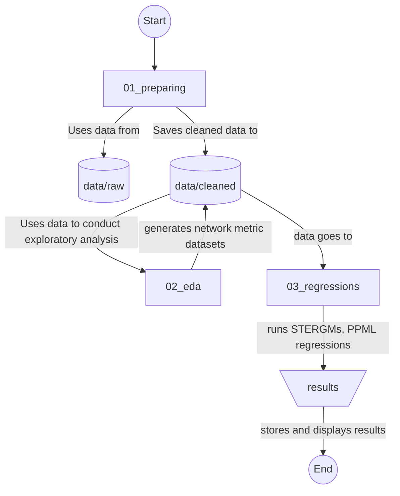

# Global_Cultural_Trade_Network

Reproduction of this project from this repository begins with `01_preparing` folder which takes data from the `raw` subfolder of the `data` folder, cleans, prepares and saves data in the 'cleaned' subfolder of the 'data' folder. Then `02_eda` folder conducts exploratory analysis, generates plots and adds network metric datasets in the `cleaned` subfolder of the `data` folder. `03_regressions` contains the STERGMs and PPML regressions, running those store STERGM results, network dynamic objects, rds files, and goodness of fit plots in the folder `results`.

I used Python packages ‘numpy’, ‘pandas’, and ‘matplotlib’ to prepare edge lists and to compute summary statistics. For calculating network centralities of weighted, directed networks, and for running STERGMs, I utilized the RStudio packages ‘igraph’, ‘wdnet’, 'network', 'intergraph', 'networkDynamic', 'sna' and ‘tergm’. Unit root testing, differencing of the non-stationary variables and PPML regressions were carried out in STATA version 18.5.

_Caveat:_ STERGM commands take almost and sometimes more than 36 hours per model. Besides, after a model completes running, the gof() function calculating goodness of fit of the model takes about 10 hours per model. Creating network dynamic objects with the hysteresis effects also takes about 24 hour each. Therefore, I saved the network dynamic objects, model results and goodness of fit stats as `rds` files in the results subfolder. However, reading those files require running all the codes in the STERGM files, which takes 30 seconds on average per file. I commented out the codes producing network dynamic objects, STERGMs results, and goodness of fit and have included readRDS codes after each computationally expensive code chunks. Now, running this complete repository takes only about 15 minutes. 
