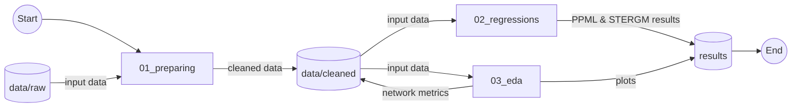

Reproduction of the project `Product Reproducibility and Trade Patterns: Evidence from Cultural Goods` from this repository begins with `01_preparing` folder which takes data from the `raw` subfolder of the `data` folder, cleans, prepares and saves data in the 'cleaned' subfolder of the 'data' folder. Then `02_regressions` contains the STERGMs and PPML regressions, running those stores STERGM results and network dynamic objects as rds and csv files, and goodness of fit plots in the `results` folder. Finally, `03_eda` produces visualizations and saves in the `results`.

```mermaid
flowchart LR
    A((Start))
    B[01_preparing]
    R[02_regressions]
    E[03_eda]
    C[(data/raw)]
    D[(data/cleaned)]
    H[(results)]
    I((End))

    A --> B

    C -->|input data| B
    B -->|cleaned data| D

    D -->|input data| R
    R -->|PPML & STERGM results| H

    D -->|input data| E
    E -->|network metrics| D
    E -->|plots| H
    H --> I
```
**Caveat:** 
STERGM commands sometimes take more than 36 hours to run depending on the network density. Besides, after a model completes running, the gof() function calculating goodness of fit of the model takes about 5-8 hours per model. Therefore, I saved the network dynamic objects from RTA, model results and goodness of fit stats as `rds` files in the results subfolder. However, reading those files require running all the codes in the STERGM files, which takes 30 seconds on average per file. I commented out all computationally expensive code chunks and included readRDS codes after each. Now, running this complete repository takes about 15 minutes. 

