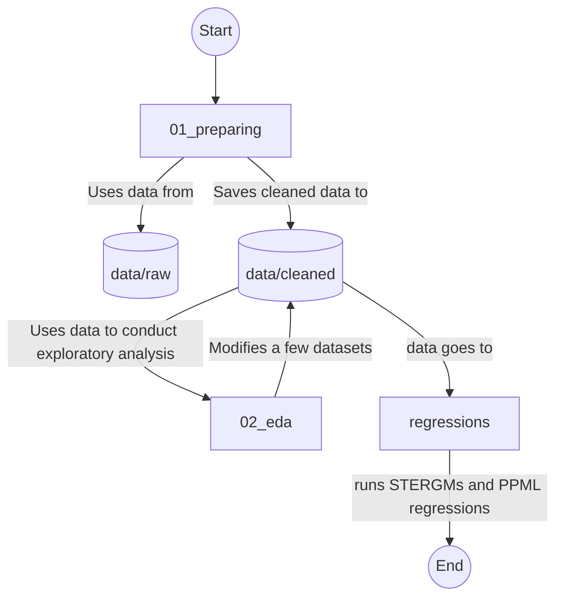

# Global_Cultural_Trade_Network

```mermaid
flowchart TD
    A((Start)) --> B[01_preparing]
    B -->|Uses data from| C[(data/raw)]
    B -->|Saves cleaned data to| D[(data/cleaned)]
    D --> |Uses data to conduct exploratory analysis|E[02_eda]
    E -->|Modifies a few datasets| D
    D --> |data goes to|F[regressions]
    F -->|runs STERGMs and PPML regressions|H((End))
```
