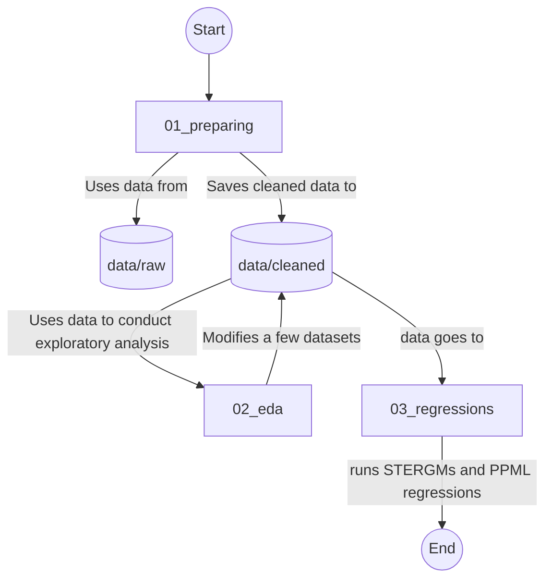

# Global_Cultural_Trade_Network
Reproduction of this project from this repository begins with `01_preparing` folder which takes data from the `raw` subfolder of the `data` folder, cleans, prepares and saves data in the 'cleaned' folder of the 'data' folder.

```mermaid
flowchart TD
    A((Start)) --> B[01_preparing]
    B -->|Uses data from| C[(data/raw)]
    B -->|Saves cleaned data to| D[(data/cleaned)]
    D --> |Uses data to conduct exploratory analysis|E[02_eda]
    E -->|Modifies a few datasets| D
    D --> |data goes to|F[03_regressions]
    F -->|runs STERGMs and PPML regressions|H((End))
```
