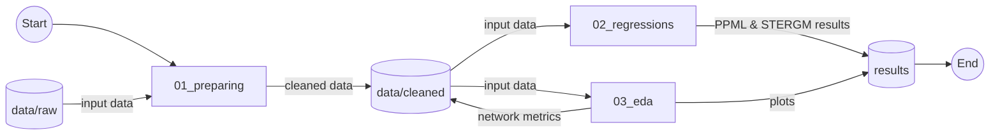

### Product Reproducibility and Trade Patterns: Evidence from Cultural Goods
This repository reproduces all analyses, and figures reported in the manuscript.

#### Research question:
Do trade patterns differ based on the reproducibility of a product?

#### Methods:
- Global trade network construction
- Dynamic network analysis (STERGM)
- PPML gravity models

#### Technical Skills Demonstrated

- Large-scale trade data processing
- Dynamic network modeling (STERGM)
- Gravity-model estimation (PPML)
- Reproducible computational workflows
- Cross-language research pipelines (Python, R, Stata)

#### Languages:
- Python
- R
- Stata
  
#### Reproduction time:
Approximately 15 minutes.

#### Reproduction steps: 
The reproduction workflow begins in the `01_preparing` folder. Scripts in this folder read raw data from `data/raw`, clean and prepare the datasets, and save processed files to `data/cleaned`.

The `02_regressions` folder contains the STERGM and PPML estimation scripts. These scripts generate model outputs, network dynamic objects, and goodness-of-fit statistics, which are stored in the `results` folder as `.rds` and `.csv` files.

Finally, scripts in `03_eda` generate all figures and visualizations and save them to the `results` folder.

```mermaid
flowchart LR
    A((Start))
    B[01_preparing]
    R[02_regressions]
    E[03_eda]
    C[(data/raw)]
    D[(data/cleaned)]
    H[(results)]
    I((End))

    A --> B

    C -->|input data| B
    B -->|cleaned data| D

    D -->|input data| R
    R -->|PPML & STERGM results| H

    D -->|input data| E
    E -->|network metrics| D
    E -->|plots| H
    H --> I
```

#### Expected outputs:
- STERGM results (`.csv`)
- Table 6
- Figure 1
- Figure 2
- Figure 3
- Figure 5
- Goodness-of-fit diagnostics for STERGM Models 1–3

#### Computational Note
Estimating STERGM models can be computationally intensive. Depending on network density, model estimation may require more than 36 hours. In addition, the `gof()` procedure used to calculate goodness-of-fit statistics can require approximately 5–8 hours per model.

To facilitate reproducibility, network dynamic objects, model outputs, and goodness-of-fit statistics have been saved as `.rds` files in the `results` directory. The computationally expensive estimation commands have been commented out and replaced with corresponding `readRDS()` commands.

Using these saved objects, the full repository can be reproduced in approximately 15 minutes. 
