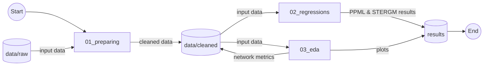

### Product Reproducibility and Trade Patterns: Evidence from Cultural Goods

This repository reproduces all analyses, tables, and figures from the manuscript.

##### Research question:
Do trade patterns differ based on the reproducibility of a product?

##### Methods:
- Global trade network construction
- Dynamic network analysis (STERGM)
- PPML gravity models

##### Languages:
- Python
- R
- Stata
- 
##### Reproduction time:
~15 minutes

##### Reproduction steps: 
Reproduction of the project begins with `01_preparing` folder which takes data from the `raw` subfolder of the `data` folder, cleans, prepares and saves data in the 'cleaned' subfolder of the 'data' folder. Then `02_regressions` contains the STERGMs and PPML regressions, running those stores STERGM results and network dynamic objects as rds and csv files, and goodness of fit plots in the `results` folder. Finally, `03_eda` produces visualizations and saves in the `results`.

```mermaid
flowchart LR
    A((Start))
    B[01_preparing]
    R[02_regressions]
    E[03_eda]
    C[(data/raw)]
    D[(data/cleaned)]
    H[(results)]
    I((End))

    A --> B

    C -->|input data| B
    B -->|cleaned data| D

    D -->|input data| R
    R -->|PPML & STERGM results| H

    D -->|input data| E
    E -->|network metrics| D
    E -->|plots| H
    H --> I
```

##### Expected outputs:
- STERGM results as csv files
- Table 6
- Figure 1
- Figure 2
- Figure 3
- STERMG goodness of fit of model 1, 2 and 3 separately
- Figure 5
  

**Caveat:** 
STERGM commands sometimes take more than 36 hours to run depending on the network density. Besides, after a model completes running, the gof() function calculating goodness of fit of the model takes about 5-8 hours per model. Therefore, I saved the network dynamic objects from RTA, model results and goodness of fit stats as `rds` files in the results subfolder. I commented out all computationally expensive code chunks and included readRDS codes after each. However, reading those files require running all the codes in the STERGM files, which takes 30 seconds on average per file.
